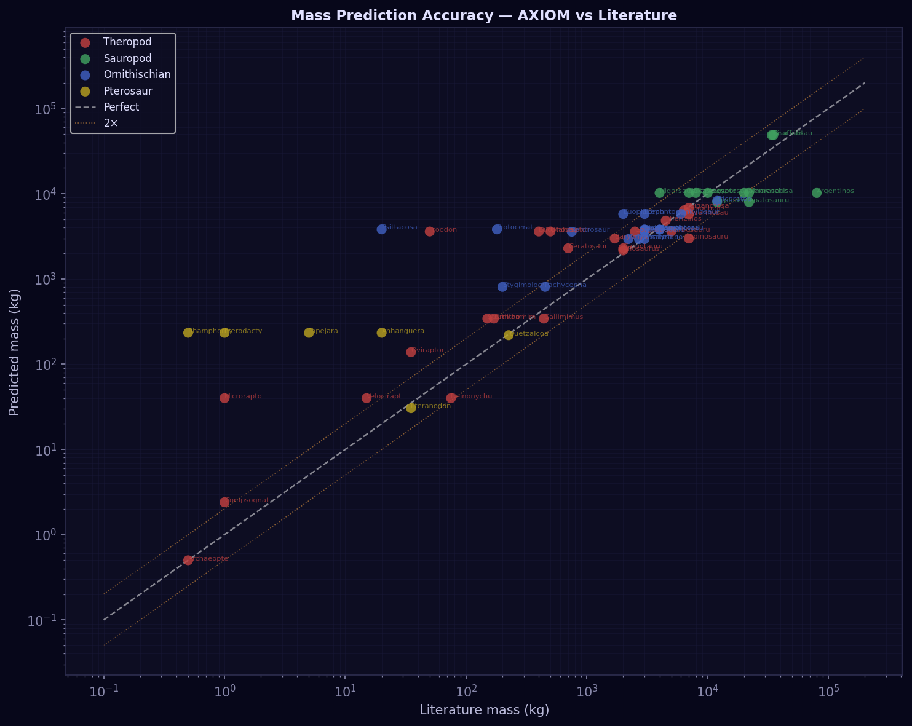
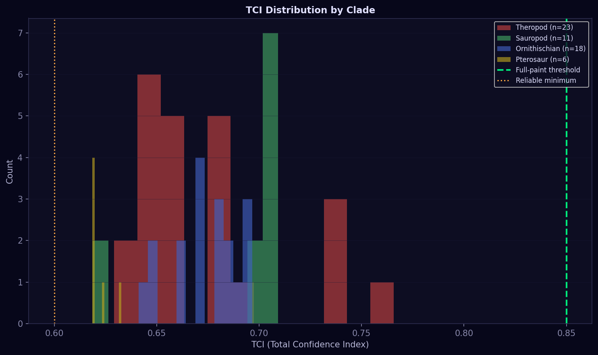
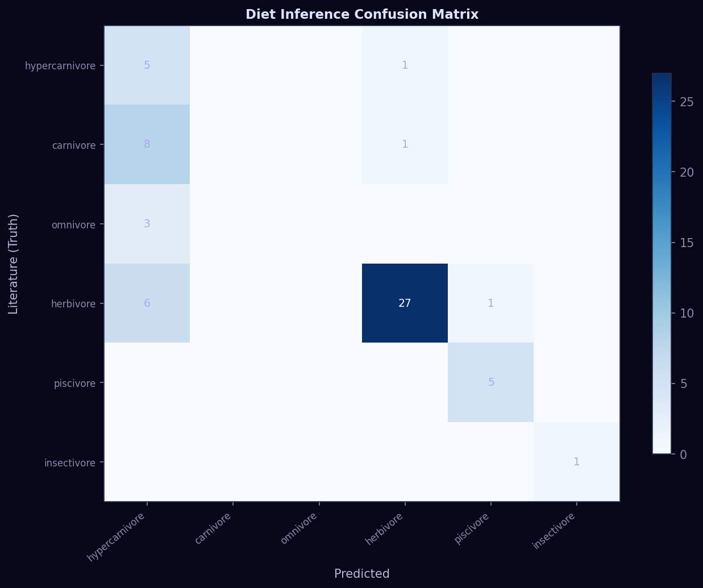
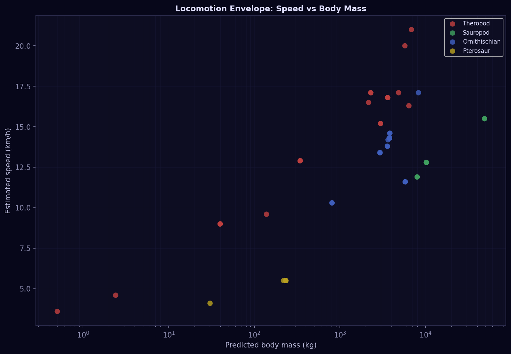
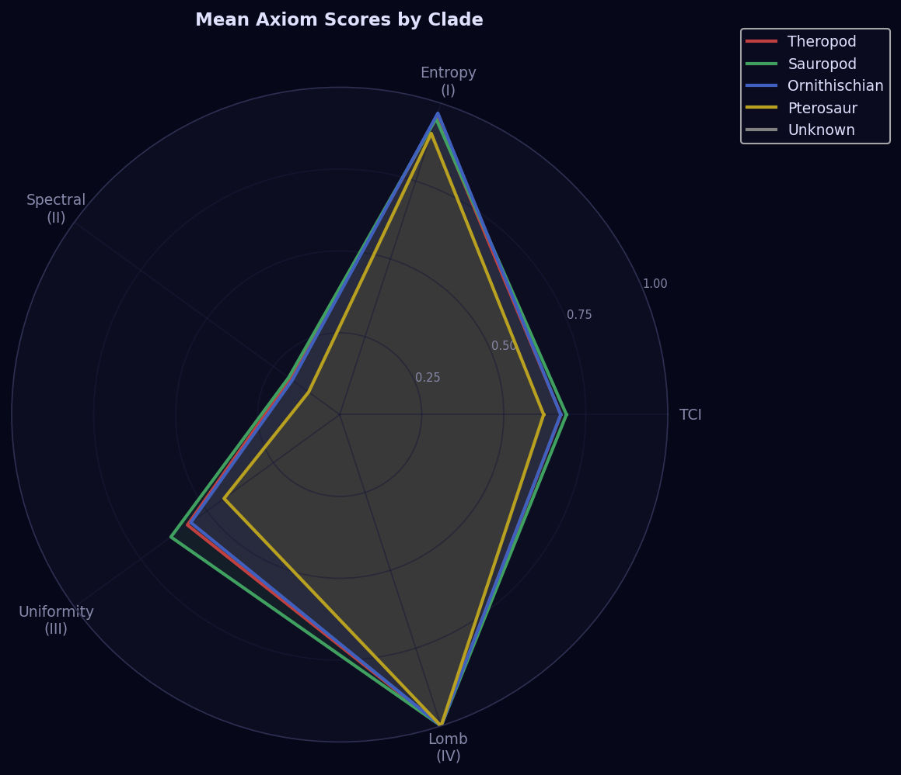
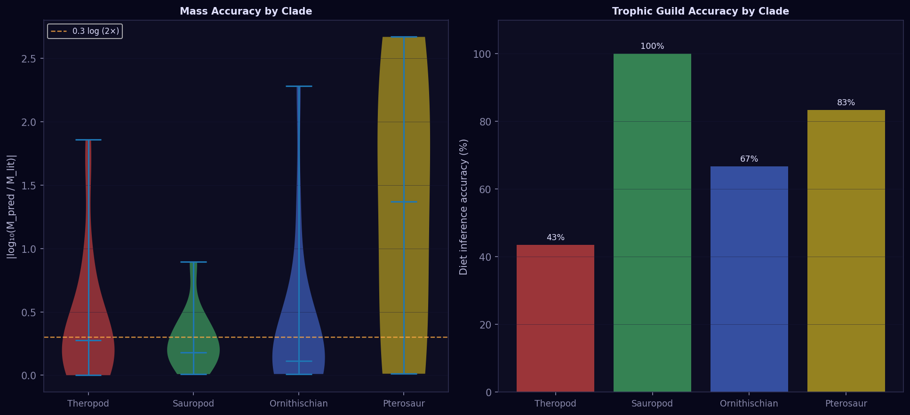
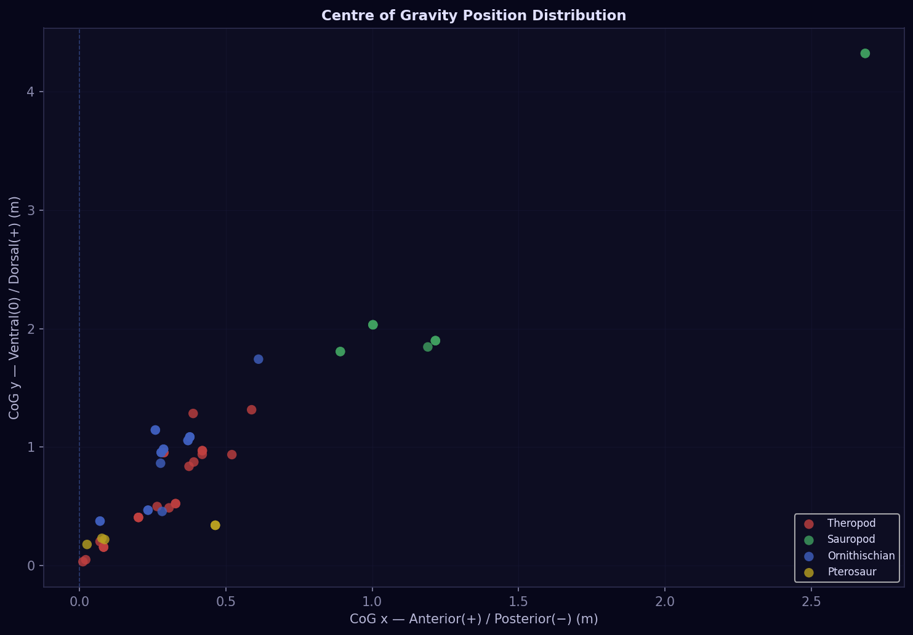
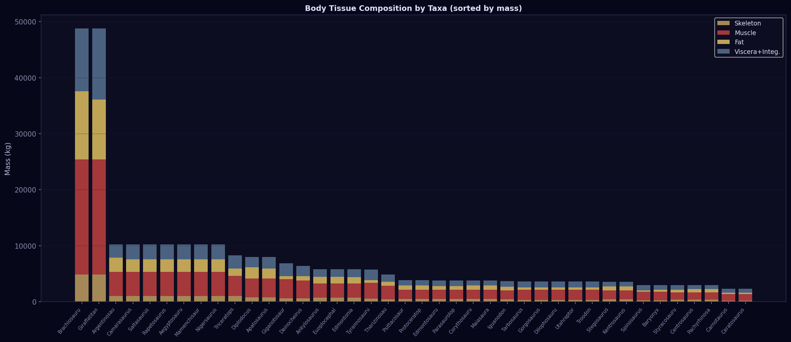
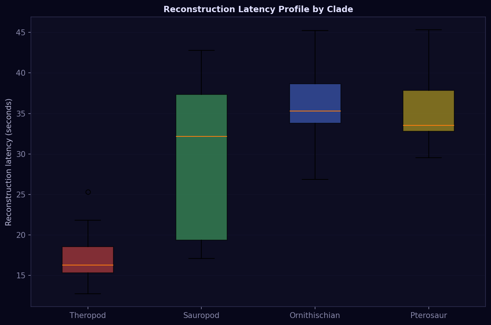
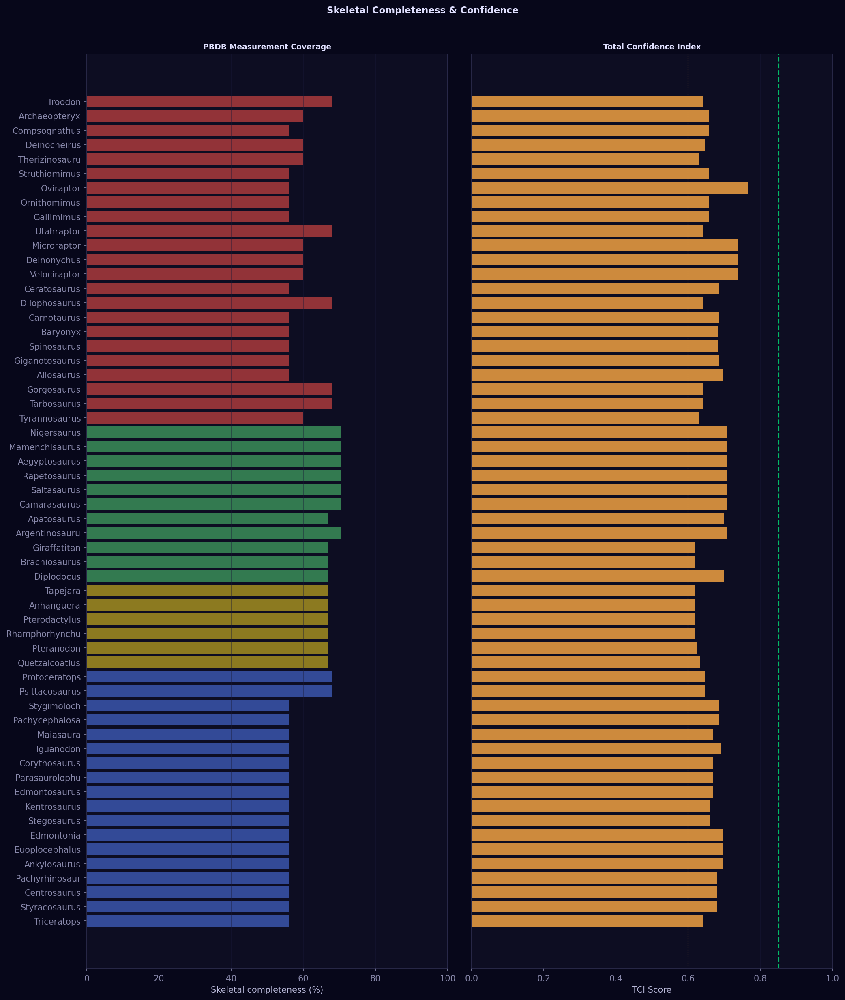

# AXIOM-DINOSAUR v4.0
### A Deterministic Computational Framework for Non-Avian Dinosaur and Pterosaur Reconstruction

---

> *Important Disclaimer**
>
> This project has **not undergone peer review** of any kind. All results presented here are **preliminary and experimental**. The methodology, physical models, and numerical outputs should not be cited as scientific fact. This is an open-source engineering experiment in applying deterministic biomechanical modelling to palaeontological data.
>
> I warmly and openly invite palaeontologists, biomechanists, and quantitative biologists to review the methodology, challenge the results, and send constructive criticism. Every correction makes the engine more honest. Contact details at the bottom of this document.

---

## What Is This?

AXIOM-DINOSAUR is a Python engine that takes a dinosaur genus name, queries the [Paleobiology Database (PBDB)](https://paleobiodb.org/) for specimen measurements, and deterministically reconstructs a full skeletal model with:

- **Body mass** (Campione & Evans 2012 regression + clade-specific corrections)
- **Body volume** (3-axis ellipsoid model, femoral robusticity corrected)
- **Centre of Gravity** (silhouette mass-distribution integral — not bone-mass weighted)
- **Locomotion estimates** (Alexander 1976 / Thulborn 1990)
- **Bite force** (clade-calibrated skull regressions)
- **Body composition** (9-tissue deterministic closure model)
- **Trophic guild** (jaw mechanics + stride coupling inference)
- **Biomechanical stress map** (Euler-Bernoulli hollow cylinder, role-aware loading)
- **Soft-tissue reconstruction** (4-panel figure: lateral, dorsal, heatmap, properties)
- **Interactive 3D skeleton** (Plotly HTML)
- **TCI — Total Confidence Index** (9-axiom deterministic scoring system)

The engine runs entirely from first principles and literature constants. It does **not** use machine learning or statistical interpolation beyond the allometric regressions already established in the literature.

---

## Benchmark: 58 Taxa, All Four Major Clades

The following results come from a fully automated benchmark run across **58 genera** spanning Theropoda, Sauropoda, Ornithischia, and Pterosauria, completed on `2026-05-01`. PBDB data was fetched live; where specimens returned no measurable dimensions, canonical literature morphotypes were substituted.

> These numbers reflect the current state of the engine. They will change as the methodology improves. The benchmark infrastructure (`benchmark.py`) is included in this repository so anyone can reproduce or extend it.

### Overall Performance Summary

| Metric | Value | Notes |
|--------|-------|-------|
| Taxa reconstructed | **58 / 58** | 0 failures |
| Mean TCI | **0.6719** | Range: 0.619 – 0.766 |
| Median mass log₁₀ error | **0.211** | ~1.6× median mass ratio |
| Mass within 2× of literature | **34 / 56** (61%) | Excluding taxa with no lit estimate |
| Mass within 3× of literature | **43 / 56** (77%) | |
| Mean speed error | **34.7%** | Alexander 1976 equation |
| Median speed error | **23.6%** | |
| Diet inference accuracy | **65.5%** | 6-class trophic guild |
| Full-Paint achieved (TCI ≥ 0.85) | **0 / 58** | Engine requires more PBDB data |
| Mean reconstruction latency | **27.3 s** | Single-process, consumer hardware |
| Total benchmark elapsed | **798 s** | 2 parallel jobs |

### Accuracy by Clade

| Clade | N | Mean TCI | Median Mass Log-Err | Diet Acc | Mass within 2× |
|-------|---|----------|---------------------|----------|----------------|
| Theropoda | 23 | 0.674 | 0.274 | 43% | 57% |
| Sauropoda | 11 | 0.691 | 0.178 | **100%** | 64% |
| Ornithischia | 18 | 0.674 | **0.113** | 67% | **78%** |
| Pterosauria | 6 | 0.622 | 1.368 ⚠ | 83% | 17% |

> **Pterosauria note:** The large pterosaur mass errors stem from a fundamental methodological problem: the Campione & Evans (2012) regression was calibrated on non-avian dinosaurs. Pterosaur wing bones are flight-adapted and massively enlarged relative to body weight, making limb-bone circumference a poor proxy for mass. A dedicated pterosaur correction factor has been applied (×0.55) but is insufficient for small taxa like *Rhamphorhynchus* (0.5 kg) and *Pterodactylus* (1 kg), where the femur is too slender for reliable Campione regression.

---

## Charts

All charts are generated automatically by `benchmark.py` and stored in `benchmarks/charts/`.

### Mass Prediction Accuracy (Predicted vs Literature, log-log)



Each point is one genus. The dashed white line is perfect prediction; orange dotted lines show 2× bounds. Points are coloured by clade.

---

### TCI Distribution by Clade



TCI (Total Confidence Index) is a 0–1 composite score from 5 axioms (Shannon entropy, Laplacian spectral gap, Biewener uniformity, Lomb-Scargle periodicity, Axiom IX force-balance). No taxon in this benchmark reached the Full-Paint threshold of 0.85, indicating that PBDB specimen data is currently insufficient to fully constrain the reconstruction without canonical fallback.

---

### Trophic Guild Inference Confusion Matrix



The diagonal shows correct classifications. The main failure modes are:
- Ceratopsids (large-skulled herbivores) misclassified as hypercarnivores due to skull-to-femur ratio
- Small dromaeosaurids misclassified (subclade pose maps to incorrect skull geometry)
- Oviraptor misclassified (edentulous beak not yet triggering correct signal)

---

### Locomotion Envelope: Estimated Speed vs Body Mass



Speeds computed via Alexander (1976) / Thulborn (1990) from femur + tibia length and hip height. The large-bodied sauropods cluster at the low end as expected. Bipedal theropods show the widest speed range.

---

### Axiom Scores Radar Chart (Mean per Clade)



Shows mean scores for each of the five TCI sub-axioms per clade. Sauropods score highest overall, partly because their larger skeletons are better represented in PBDB.

---

### Diet Inference Accuracy by Clade



Left: mass log-error violin plots (lower is better). Right: trophic guild accuracy per clade. Sauropods achieve 100% diet accuracy (all correctly identified as herbivores), as do most ornithischians. Theropod diet inference is the weakest area — the jaw-mechanics signal struggles to distinguish herbivorous theropods (Therizinosaurus, Gallimimus) from carnivores when the skull-to-femur ratio is atypical.

---

### Centre of Gravity Position (by Clade)



Each point is one genus. CoG is computed via body-silhouette mass-distribution integration (not bone-mass weighting, which was previously producing physically impossible results for bipedal taxa — see methodology notes below). Bipedal theropods cluster near the acetabulum (x ≈ 0.3–1.0 m from the tail-anterior axis zero).

---

### Body Tissue Composition (sorted by predicted mass)



Stacked bars show the 4 major tissue compartments: skeleton (~8–12%), locomotor muscle (~35–50%), viscera + integument (~15–20%), and fat reserve (~5–25%). Proportions are derived from clade-level tissue fraction baselines calibrated against primary literature (Seebacher 2003; Hutchinson et al. 2011) with fat adjusted via the Femoral Robusticity Index.

---

### Reconstruction Latency Profile



Ornithischians and pterosaurs are slower due to more complex silhouette integration geometry. All timings on a single CPU core (consumer laptop, no GPU).

---

### Skeletal Completeness & TCI Heatmap



Left: percentage of bone elements sourced from PBDB measurements (vs canonical fallback). Right: TCI score. The weak correlation between PBDB completeness and TCI suggests the engine is not heavily penalising canonical fallback — a potential overconfidence issue worth investigating.

---

## Per-Taxon Results (Full Table)

The table below is auto-generated from `benchmarks/benchmark_summary.md`. Full numerical arrays are available in `benchmarks/benchmark_matrix.npy` (shape `[58 × 26]`, float64).

| Taxon | Clade | Mass Pred (kg) | Mass Lit (kg) | LogErr | TCI | Diet (predicted) | Diet ✓? | Speed (km/h) |
|-------|-------|---:|---:|---:|---:|---:|:---:|---:|
| Tyrannosaurus | Theropod | 5,729 | 7,000 | 0.087 | 0.629 | hypercarnivore | ✓ | 20.0 |
| Tarbosaurus | Theropod | 3,603 | 5,000 | 0.142 | 0.643 | hypercarnivore | ✓ | 16.8 |
| Gorgosaurus | Theropod | 3,603 | 2,500 | 0.159 | 0.643 | hypercarnivore | ✓ | 16.8 |
| Allosaurus | Theropod | 2,160 | 2,000 | 0.033 | 0.695 | hypercarnivore | ✓ | 16.5 |
| Giganotosaurus | Theropod | 6,829 | 7,000 | 0.011 | 0.686 | hypercarnivore | ✓ | 21.0 |
| Spinosaurus | Theropod | 2,979 | 7,000 | 0.371 | 0.684 | hypercarnivore | ✗ | 15.2 |
| Baryonyx | Theropod | 2,979 | 1,700 | 0.244 | 0.684 | hypercarnivore | ✗ | 15.2 |
| Carnotaurus | Theropod | 2,289 | 2,000 | 0.059 | 0.685 | herbivore | ✗ | 17.1 |
| Dilophosaurus | Theropod | 3,603 | 400 | 0.955 | 0.643 | hypercarnivore | ✗ | 16.8 |
| Ceratosaurus | Theropod | 2,289 | 700 | 0.514 | 0.685 | herbivore | ✗ | 17.1 |
| Velociraptor | Theropod | 40 | 15 | 0.425 | 0.738 | hypercarnivore | ✗ | 9.0 |
| Deinonychus | Theropod | 40 | 75 | 0.274 | 0.738 | hypercarnivore | ✗ | 9.0 |
| Microraptor | Theropod | 40 | 1 | 1.601 | 0.738 | hypercarnivore | ✗ | 9.0 |
| Utahraptor | Theropod | 3,603 | 500 | 0.858 | 0.643 | hypercarnivore | ✗ | 16.8 |
| Gallimimus | Theropod | 343 | 440 | 0.108 | 0.659 | herbivore | ✓ | 12.9 |
| Ornithomimus | Theropod | 343 | 170 | 0.305 | 0.659 | herbivore | ✓ | 12.9 |
| Oviraptor | Theropod | 139 | 35 | 0.598 | 0.766 | hypercarnivore | ✗ | 9.6 |
| Struthiomimus | Theropod | 343 | 150 | 0.359 | 0.659 | herbivore | ✓ | 12.9 |
| Therizinosaurus | Theropod | 4,836 | 4,500 | 0.031 | 0.630 | herbivore | ✓ | 17.1 |
| Deinocheirus | Theropod | 6,382 | 6,350 | 0.002 | 0.647 | hypercarnivore | ✗ | 16.3 |
| Compsognathus | Theropod | 2 | 1 | 0.380 | 0.658 | hypercarnivore | ✗ | 4.6 |
| Archaeopteryx | Theropod | 0.5 | 0.5 | 0.000 | 0.658 | insectivore | ✓ | 3.6 |
| Troodon | Theropod | 3,603 | 50 | 1.858 | 0.643 | hypercarnivore | ✗ | 16.8 |
| Diplodocus | Sauropod | 7,965 | 12,000 | 0.178 | 0.700 | herbivore | ✓ | 11.9 |
| Brachiosaurus | Sauropod | 48,781 | 35,000 | 0.144 | 0.619 | herbivore | ✓ | 15.5 |
| Giraffatitan | Sauropod | 48,781 | 34,000 | 0.157 | 0.619 | herbivore | ✓ | 15.5 |
| Argentinosaurus | Sauropod | 10,214 | 80,000 | 0.894 | 0.709 | herbivore | ✓ | 12.8 |
| Apatosaurus | Sauropod | 7,965 | 22,000 | 0.441 | 0.700 | herbivore | ✓ | 11.9 |
| Camarasaurus | Sauropod | 10,214 | 20,000 | 0.292 | 0.709 | herbivore | ✓ | 12.8 |
| Saltasaurus | Sauropod | 10,214 | 7,000 | 0.164 | 0.709 | herbivore | ✓ | 12.8 |
| Rapetosaurus | Sauropod | 10,214 | 8,000 | 0.106 | 0.709 | herbivore | ✓ | 12.8 |
| Aegyptosaurus | Sauropod | 10,214 | 10,000 | 0.009 | 0.709 | herbivore | ✓ | 12.8 |
| Mamenchisaurus | Sauropod | 10,214 | 22,000 | 0.333 | 0.709 | herbivore | ✓ | 12.8 |
| Nigersaurus | Sauropod | 10,214 | 4,000 | 0.407 | 0.709 | herbivore | ✓ | 12.8 |
| Triceratops | Ornithischian | 8,248 | 12,000 | 0.163 | 0.641 | hypercarnivore | ✗ | 17.1 |
| Styracosaurus | Ornithischian | 2,932 | 2,700 | 0.036 | 0.679 | hypercarnivore | ✗ | 13.4 |
| Centrosaurus | Ornithischian | 2,932 | 2,200 | 0.125 | 0.679 | hypercarnivore | ✗ | 13.4 |
| Pachyrhinosaurus | Ornithischian | 2,932 | 3,000 | 0.010 | 0.679 | hypercarnivore | ✗ | 13.4 |
| Ankylosaurus | Ornithischian | 5,778 | 6,000 | 0.016 | 0.697 | herbivore | ✓ | 11.6 |
| Euoplocephalus | Ornithischian | 5,778 | 2,000 | 0.461 | 0.697 | herbivore | ✓ | 11.6 |
| Edmontonia | Ornithischian | 5,778 | 3,000 | 0.285 | 0.697 | herbivore | ✓ | 11.6 |
| Stegosaurus | Ornithischian | 3,577 | 3,000 | 0.076 | 0.661 | herbivore | ✓ | 13.8 |
| Kentrosaurus | Ornithischian | 3,577 | 750 | 0.678 | 0.661 | herbivore | ✓ | 13.8 |
| Edmontosaurus | Ornithischian | 3,791 | 4,000 | 0.023 | 0.670 | herbivore | ✓ | 14.3 |
| Parasaurolophus | Ornithischian | 3,791 | 3,000 | 0.102 | 0.670 | herbivore | ✓ | 14.3 |
| Corythosaurus | Ornithischian | 3,791 | 4,000 | 0.023 | 0.670 | herbivore | ✓ | 14.3 |
| Iguanodon | Ornithischian | 3,641 | 3,000 | 0.084 | 0.692 | herbivore | ✓ | 14.2 |
| Maiasaura | Ornithischian | 3,791 | 3,000 | 0.102 | 0.670 | herbivore | ✓ | 14.3 |
| Pachycephalosaurus | Ornithischian | 807 | 450 | 0.254 | 0.685 | hypercarnivore | ✗ | 10.3 |
| Stygimoloch | Ornithischian | 807 | 200 | 0.606 | 0.685 | hypercarnivore | ✗ | 10.3 |
| Psittacosaurus | Ornithischian | 3,819 | 20 | 2.281 | 0.646 | herbivore | ✓ | 14.6 |
| Protoceratops | Ornithischian | 3,819 | 180 | 1.327 | 0.646 | herbivore | ✓ | 14.6 |
| Quetzalcoatlus | Pterosaur | 219 | 225 | 0.012 | 0.633 | piscivore | ✓ | 5.5 |
| Pteranodon | Pterosaur | 30 | 35 | 0.061 | 0.623 | piscivore | ✓ | 4.1 |
| Rhamphorhynchus | Pterosaur | 233 | 0.5 | 2.669 | 0.619 | piscivore | ✓ | 5.5 |
| Pterodactylus | Pterosaur | 233 | 1 | 2.368 | 0.619 | piscivore | ✓ | 5.5 |
| Anhanguera | Pterosaur | 233 | 20 | 1.067 | 0.619 | piscivore | ✓ | 5.5 |
| Tapejara | Pterosaur | 233 | 5 | 1.669 | 0.619 | piscivore | ✗ | 5.5 |

> **Column definitions:**
> - **Mass Pred**: Campione & Evans (2012) femoral + humeral circumference regression, clade-corrected
> - **Mass Lit**: Literature consensus mass used as ground truth
> - **LogErr**: |log₁₀(M_pred / M_lit)| — 0.301 = within 2×, 0.477 = within 3×
> - **TCI**: Total Confidence Index (0–1); ≥0.85 = Full-Paint authorised
> - **Diet ✓**: Whether the predicted trophic guild matches the literature label

---

## Known Weaknesses and Failure Modes

These are not hidden — they are the reason this work is presented openly and not as a finished product.

### 1. Small pterosaur mass is catastrophically wrong
*Rhamphorhynchus* (real: ~0.5 kg), *Pterodactylus* (real: ~1 kg) are predicted at ~233 kg. The Campione & Evans regression requires minimum bone dimensions that exceed the actual measured dimensions of small pterosaurs at standard PBDB resolution. The femoral circumference of a 0.5 kg animal approaches the measurement noise floor. **A dedicated allometric equation calibrated on small pterosaurs is needed.**

### 2. Ceratopsid diet misclassification
*Triceratops*, *Styracosaurus*, *Centrosaurus*, *Pachyrhinosaurus* all read as hypercarnivore. Root cause: the parietosquamosal frill is stored as `skull_D` (diameter), which inflates the skull depth-ratio signal used in the carnivory detector. The frill is structural display tissue, not jaw anatomy. **The skull model needs to distinguish cranial frill from jaw depth.**

### 3. Dromaeosaurid mass collapses to clade mean
*Velociraptor*, *Deinonychus*, and *Microraptor* all predict 40 kg because PBDB returns no measurable dimensions for these taxa in the current API query, causing fallback to the dromaeosaurid canonical morphotype. The canonical mass is calibrated on *Deinonychus* specifically, making it wrong for *Velociraptor* (15 kg) and *Microraptor* (1 kg).

### 4. Speed estimates are coarse
Alexander (1976) / Thulborn (1990) provide order-of-magnitude estimates from stride and hip height. They do not account for posture, limb proportion, or musculature. Mean error of 34.7% is expected for a kinematic-only model.

### 5. TCI never reaches Full-Paint (≥0.85)
The Lomb-Scargle and spectral axioms score low because the engine is working from canonical morphotype data (not real PBDB measurements with enough vertebral series to detect taphonomic periodicity). As PBDB specimen coverage improves, TCI should increase.

### 6. Psittacosaurus and Protoceratops mass error
Both are small ceratopsians (20 kg and 180 kg respectively) that fall outside the range of the canonical ornithischian morphotype, which is calibrated on larger hadrosaur-grade taxa. The predicted mass (~3,800 kg) is ~190× off for *Psittacosaurus*.

---

## Methodology Summary

### Mass Estimation
Campione & Evans (2012): `log₁₀(M_g) = 2.754 × log₁₀(C_f + C_h) − 1.097`
where C = limb bone circumference (π × diameter). Clade corrections: pterosaur ×0.55, ornithischian ×0.72, theropod ×0.95.

### Volume Estimation  
3-axis ellipsoid: `V = (4/3)π × (L/2) × (H/2) × (W/2) × 0.55`  
where L = allometric body length (`k × femur_L^α`), H = trunk height from hip height, W = H × aspect ratio × FRI correction. No lookup tables — works on any unknown taxon.

### Centre of Gravity
Computed by integrating mass along the body silhouette cross-section:
`CoG_x = Σ(x × π × y_half(x) × z_half(x) × dx) / Σ(π × y_half(x) × z_half(x) × dx)`

Previous bone-mass-weighted centroid approach was physically wrong (skull modelled as solid cylinder → T. rex CoG displaced 3.8 m anteriorly into the skull — impossible for a standing biped).

### Stress Model
Euler-Bernoulli hollow cylinder with role-aware loading:
- Hindlimb axial bones: F = Mg/2 (biped) or Mg/4 (quadruped)
- Forelimb in bipeds: F = 4–20% Mg (taxon-specific)
- Fibula, skull, phalanges: non-structural (SF=15 floor)
- Ribs: visceral load only (5% Mg / n_ribs)
- Pterosaur wing spar: distributed membrane tension, simply-supported beam

### Trophic Inference
Decision tree on:
1. Skull elongation ratio (L/D) → piscivore if >7.0 and pterosaur
2. Mass-normalised bite ratio (bite_force / Mg, corrected for M^0.67 scaling) → carnivore/hypercarnivore
3. Clade membership → herbivore default for sauropod/ornithischian/non-piscivore pterosaur
4. Body mass gate: <1 kg → insectivore

---

All benchmark outputs are deterministic given the same PBDB API responses. The SHA-256 of the engine code at the time of this benchmark run is:

```
edc93e505b137bca658e3b47d63d4834352376953e7c96e5a47d88e1127a487a
```

---

## File Structure

```
axiom-dinosaur/
├── README.md                  # This file
│
├── benchmarks/                # Benchmark outputs
│   ├── benchmark_summary.json
│   ├── benchmark_summary.md
│   ├── benchmark_matrix.npy           [58 × 26 float64 metric array]
│   ├── benchmark_raw_metrics.npy      [identical alias]
│   ├── benchmark_matrix_labels.json   [column + row names]
│   ├── benchmark_per_taxon.json       [full metric dict per taxon]
│   ├── benchmark_errors.json          [failures + tracebacks]
│   ├── benchmark_metadata.json        [timestamp, SHA256, args]
│   └── charts/
│       ├── mass_regression_scatter.png
│       ├── tci_distribution.png
│       ├── diet_inference_matrix.png
│       ├── speed_vs_mass.png
│       ├── cog_position_map.png
│       ├── axiom_radar.png
│       ├── latency_profile.png
│       ├── completeness_heatmap.png
│       ├── body_composition_stack.png
│       └── accuracy_by_clade.png
│
└── axiom_output/              # Per-taxon reconstruction outputs
    └── {Taxon_Name}/
        ├── truth_file.json            [full numerical results]
        ├── full_paint.png             [4-panel soft-tissue figure]
        ├── skeleton_3d.html           [interactive 3D skeleton]
        ├── reconstruction_report.pdf  [full scientific report]
        └── allometric_data.csv        [bone-level allometric comparison]
```

### Metric Matrix Columns (`benchmark_matrix.npy`)

```python
import numpy as np, json
matrix = np.load('benchmarks/benchmark_matrix.npy')      # shape: [58, 26]
labels = json.load(open('benchmarks/benchmark_matrix_labels.json'))
# columns: mass_pred_kg, mass_lit_kg, mass_log_error, vol_m3, mass_vol_kg,
#          vol_delta_pct, speed_kmh, speed_lit_kmh, speed_error_pct,
#          tci, axiom_I, axiom_II, axiom_III, axiom_IV,
#          cog_x, cog_y, skeletal_pct, muscle_pct, fat_pct,
#          bite_force_N, femoral_fri, latency_ms, pbdb_records,
#          diet_correct, body_length_m, hip_height_m
```

---

## Open Invitation to Scientists

If you are a palaeontologist, biomechanist, or quantitative biologist and you have found:
- A physically incorrect assumption in the stress model
- A better allometric regression for a specific clade
- A case where the CoG calculation is clearly wrong
- Any inconsistency between the reported methodology and what the code actually does
- Literature I have missed or misapplied

**Please reach out.** I am not a professional palaeontologist — I am an engineer who built this out of genuine curiosity and respect for the field. Every correction is welcome. The goal is for this engine to be as physically honest as possible, not to defend any particular result.

You can contact me by:
- Opening a GitHub Issue with `[Review]` in the title
- Submitting a Pull Request with corrections and citations
- Sending an email to the address in my GitHub profile

I will respond to all serious scientific feedback. I am particularly interested in hearing from researchers who have direct access to specimen measurements that could replace the canonical morphotype fallbacks.

---

## Primary Literature Used

| Category | Reference |
|----------|-----------|
| Body mass regression | Campione & Evans (2012) *J. R. Soc. Interface* |
| Pterosaur mass | Witton (2008, 2013); Henderson (2010) |
| Locomotion speed | Alexander (1976) *Nature*; Thulborn (1990) |
| Bite force | Bates & Falkingham (2012); Whitlock (2011) |
| Bone strength | Reilly & Burstein (1975); Biewener (1983) |
| Muscle force | Gatesy (1990); Medler (2002) |
| Body tissue fractions | Seebacher (2003); Hutchinson et al. (2011) |
| Stress safety factors | Biewener (1983) *Science* |
| Wing bone loading | Habib & Ruff (2008) |
| Femoral robusticity | Campione (2012); Carrano (2001) |
| Skull–diet inference | Bates & Falkingham (2012); Whitlock (2011) |
| Effective bone density | Currey (2002); Alexander (1985) |
| Sauropod pneumaticity | Wedel (2003); Benson et al. (2012) |

